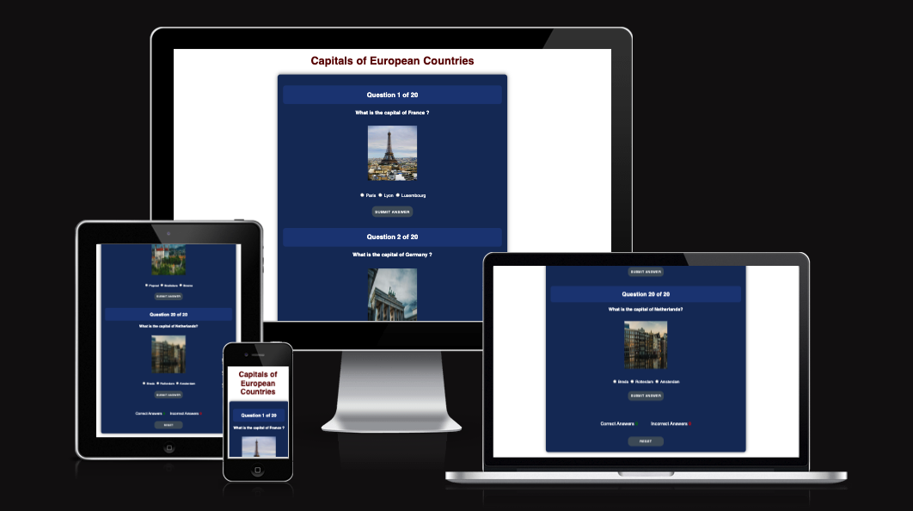
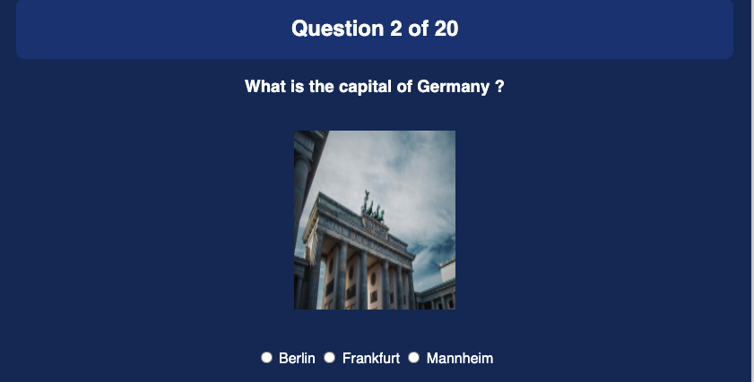

# Capitals of European Countries

Capitals of European Countries is a cultural site that hopes to help friends, colleagues and family members to know the  different capitals of the european countries with a play style. It hopes to demonstrate how pure Javascript works in a real-world context.

Users of this game will learn the capitals of each countrie european. This site will be targeted towards adults and children alike as a simple application to learn, practice and have fun with.

## Features
### Existing Features

* Header

  
  - Featured at the top of the page, the Capitals of European Countries heading is easy to see for the user. Upon viewing the page, the user will be able to see the name of the game and know what the game they are playing.

  

* The Questions and Answers area

  
  - This section will allow the user to start the game. The user will be able to easily see the question and the radio buttons in order to answer.
  
  - The user will be able to select the correct answer by clicking on the correct radio button between the different options.

  

  - The user will be able to submit their answer and a pop-up will make it known to the user if they answered correctly.
 
  

* The Score area 

  - The results and score are clear to the user, allowing the user to see exactly how many correct and incorrect answers they have provided.

* The Reset button 

  - The user can refresh the page and return to the initiation with the (..................)

  

  #### Features Left to implement 
  * When there is time, I would like to expand this cultural quiz game to include another type of culturals questions.(.......)

## Testing 

* I tested running the game in different browsers: Chrome, Firefox, Safari.

* I confirmed that the game results are always run.

* I confirmed that the header, options in radio button and results are all readable and easy to understand.

* I confirmed that the colors and images chosen are easy to read and accessible by running it through lighthouse in devtools.

(screenshot lal testing)

* I confirmed that this project is responsive, looks good and functions on all standard screen sizes using the devtools device toolbar.

### Bugs

#### Solved bugs 

(bade ishra7 3n lperformance)

### Validator Testing

* HTML 

  - No errors were returned when passing through the official [W3C validator](https://validator.w3.org)

* CSS 
  - No errors were found when passing through the official [(Jigsaw) validator](https://jigsaw.w3.org/css-validator/)

* JavaScript
  - No errors were found when passing through the official [Jshint validator](https://jshint.com/)

  (tafasil 3n ljavascript wl function)

  ### Unfixed Bugs

  No Unfixed bugs

  ## Deployment

* The site was deployed to GitHub pages. The steps to deploy are as follows: 

  - In the GitHub repository, navigate to the Settings tab

  - From the source section drop-down menu, select the Master Branch

  - Once the master branch has been selected, the page provided the link to the completed website.

  The live link can be found here- https://hawraa7.github.io/Portfolio-Project-2/

  ## Credits

  ### Media

* The images was taken from [Pexels](https://www.pexels.com/)

  

